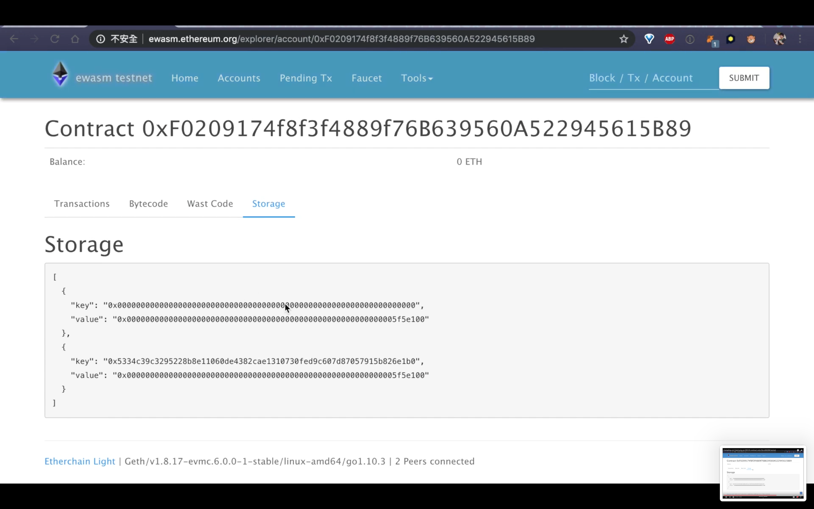

[//]: # (SPDX-License-Identifier: Apache-2.0 WITH LLVM-exception)

# 1. Introduction
**SOLL** is a new compiler for generating [Ewasm](https://github.com/ewasm) (Ethereum flavored WebAssembly) files from Solidity and Yul.

To support developers as many as possible, we design projects to not only support more smart contract programming languages, such as Rust and C++, but also support various VMs, such as Ewasm VM and evm. To achieve this goal, in the very first step, we develop SOLL, a compiler for Solidity-based smart contract running on Ewasm VM.

For application users, please refer to this document. You will know how to use SOLL to generate Ewasm bytecode from your Solidity smart contract or Yul language, and then deploy the Ewasm bytecode to Ethereum Ewasm TestNet.

For developers, we provide another document for explaining the design of SOLL and how to develop and test the functionality of SOLL, please refer to the [Developer Guide](doc/guides/DevGuide.md) for more details.

# 2. Current Status and Limitations

SOLL is still in early stage, and we’ve not fully supported Solidity and Yul. Please check features we’ve done and limitations in the following documents.

* [Feature Guide for Solidity](doc/guides/FeatureGuideForSolidity.md)
* [Feature Guide for Yul](doc/guides/FeatureGuideForYul.md)
* [Known Issues](doc/KnownIssues.md)

And SOLL integrates Solidity and Yul test contracts from [ethereum/solidity](https://github.com/ethereum/solidity/tree/develop/test).

Here is the pass rate of both language:

Solidity test suite (Total 80 tests from compilationTests):
```bash
Expected Passes    : 27 # Solidity has 80 testing contract, and SOLL can pass 27.
Unsupported Tests  : 53 # Unimplemented by SOLL
Pass Rate: 34%
```

Yul test suite (Total 499 tests from libyul):
```bash
Expected Passes    : 393 # libyul has 499 testing contracts, and SOLL can pass 393.
Unsupported Tests  : 106 # Unimplemented by SOLL
Pass Rate: 79%
```

# 3. Getting Started

To get started with our demonstration, you will need prepare two components at first.

- Pre-install **Docker** and pull our [docker image](https://hub.docker.com/r/secondstate/soll)
> *We provide an image include build and execute environment (recommend).
> If you don't want to use docker directly you will need below tools (cmake, llvm, xxd, wabt, node.js).*

- **SOLL** https://github.com/second-state/soll

## 3.1 Preparation

- Pull official docker image to get an already established build/execute environment.
```bash
> docker pull secondstate/soll
```

- Get Source Code from Github and checkout to the latest version, 0.0.6.
```bash
> git clone --recursive https://github.com/second-state/soll.git
> cd soll
> git checkout 0.0.6
```

## 3.2 Launch Environment

Attach shell to container and bind volume with repositories' path.
```bash
> docker run -it --rm \
      -v $(pwd)/soll:/root/soll \
      secondstate/soll
```

## 3.3 Build SOLL

Build SOLL(we use cmake with llvm library)
```bash
(docker) $ cd ~/soll && mkdir -p build && cd build
(docker) $ cmake .. && make
```

## 3.4 Compile an ERC20 smart contract

Create your smart contract files by copying from our demonstration contract "0-0-3.sol".
```bash
(docker) $ cd ~
(docker) $ cp ~/soll/doc/examples/0-0-3.sol ~/contract.sol
```

Execute SOLL to generate Ewasm bytecode(.wasm).
```bash
(docker) $ ~/soll/build/tools/soll/soll contract.sol
```

We will use "contract.wasm" in the next section to deploy it to Ewasm TestNet.

## 3.5 Deploy an ERC20 smart contract to Ewasm TestNet
> **Ewasm TestNet is unavailable now**.  
> So we provid other workaround test demonstration in [Developer Guide](doc/guides/DevGuide.md#deploy-and-execute-ewasm-on-devchain).

### **Step 1: Convert Wasm files to Hex Code files.**

To deploy our smart contract to TestNet, we need to convert the WASM files to Hex Code files.

```bash
(docker) $ xxd -p contract.wasm | tr -d $'\n'
```

### **Step 2: Submit the Hex Code files to Ewasm TestNet.**

Copy the Hex Code generated by the previous step.


Paste the Hex Code to Ewasm TestNet website and submit it.


Submit the Hex Code to Ewasm TestNet.


### **Step 3: Check activities of TestNet to make sure our contracts executed successfully.**

Check whether the latest activity is our contract or not.


Check the Bytecode of the latest activity.


Check the Ewasm code of the latest activity.


Check the Storage part of the latest activity.



Congratulations! Now you finished our user tutorial.
