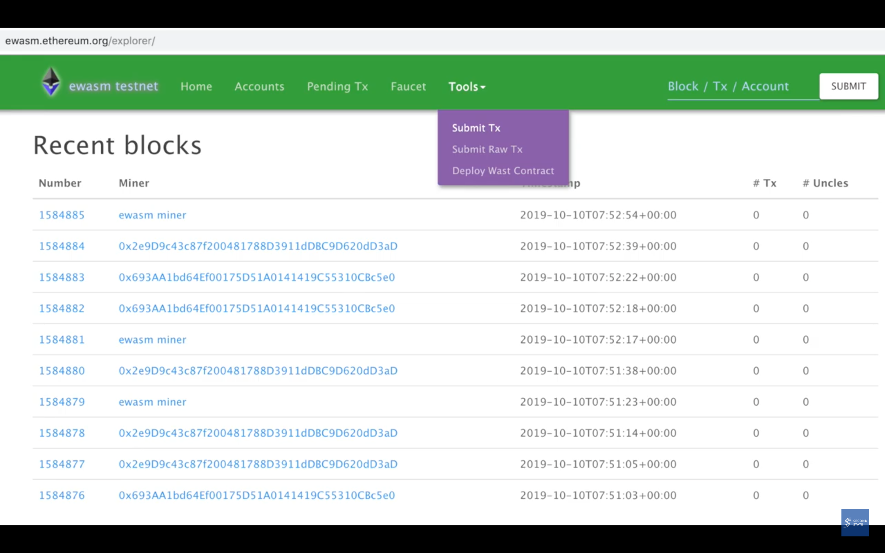
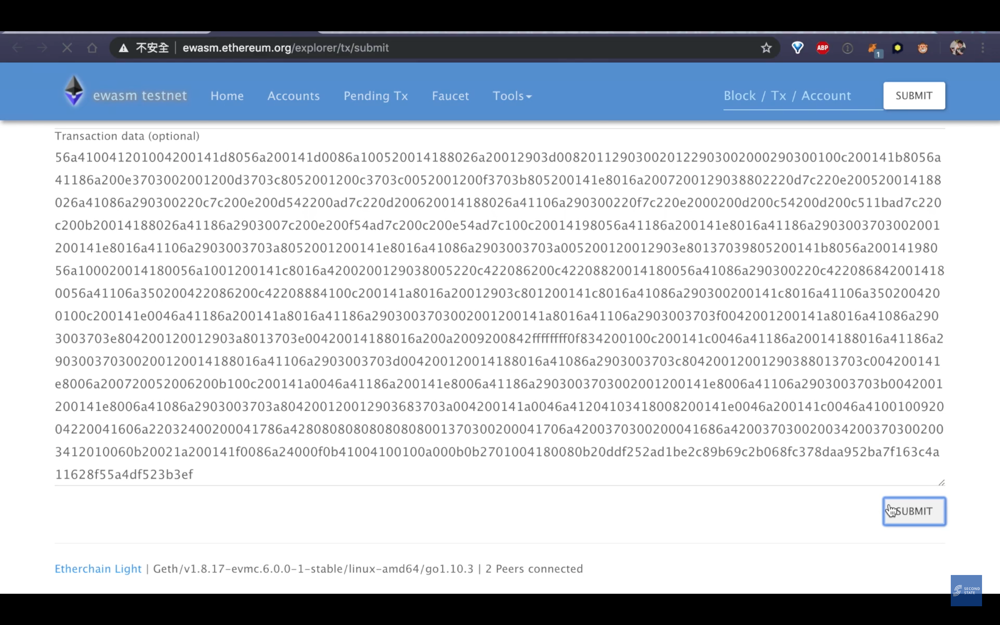
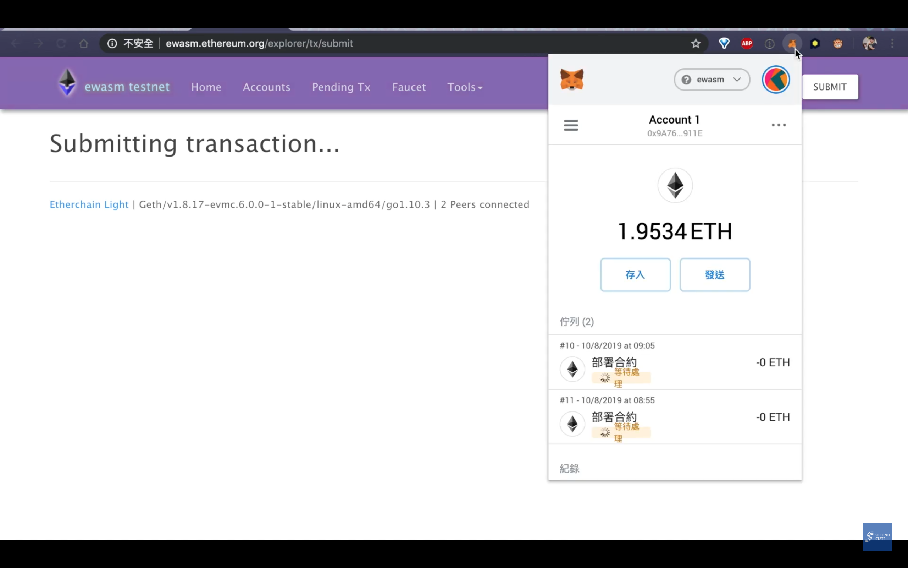
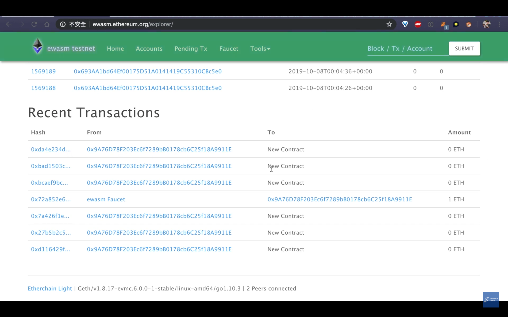
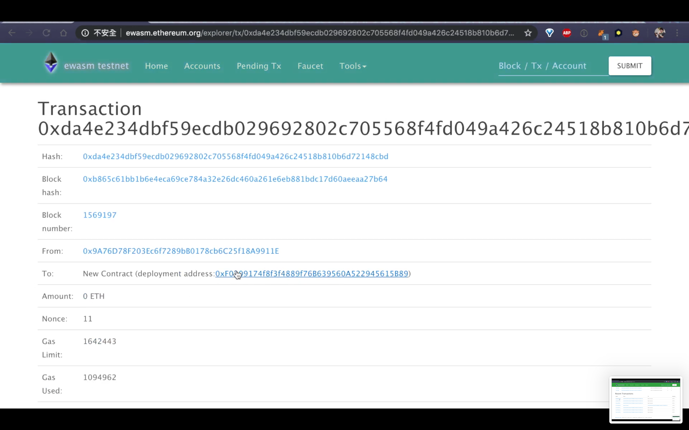
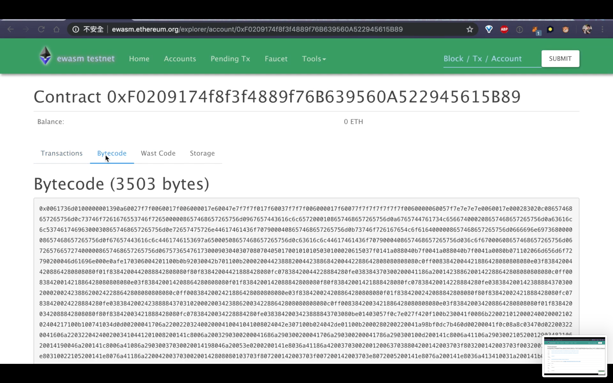
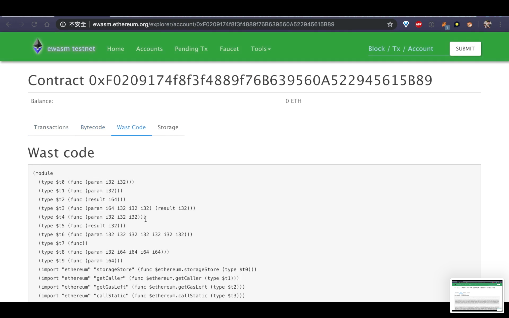
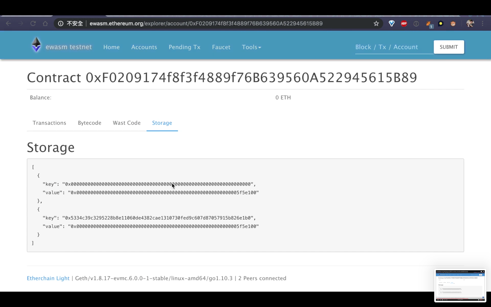

[//]: # (SPDX-License-Identifier: Apache-2.0 WITH LLVM-exception)

# Deploy an ERC20 smart contract to Ewasm TestNet

## Warning: This tutorial is deprecated because Ewasm TestNet is unavailable now

### **Step 1: Convert Wasm files to Hex Code files.**

To deploy our smart contract to TestNet, we need to convert the WASM files to Hex Code files.

```bash
(docker) $ xxd -p contract.wasm | tr -d $'\n'
```

### **Step 2: Submit the Hex Code files to Ewasm TestNet.**

Copy the Hex Code generated by the previous step.



Paste the Hex Code to the Ewasm TestNet website and submit it.



Submit the Hex Code to Ewasm TestNet.



### **Step 3: Check activities of TestNet to make sure our contracts executed successfully.**

Check whether the latest activity is our contract or not.




Check the Bytecode of the latest activity.



Check the Ewasm code of the latest activity.



Check the Storage part of the latest activity.



Congratulations! Now you finished our user tutorial.
